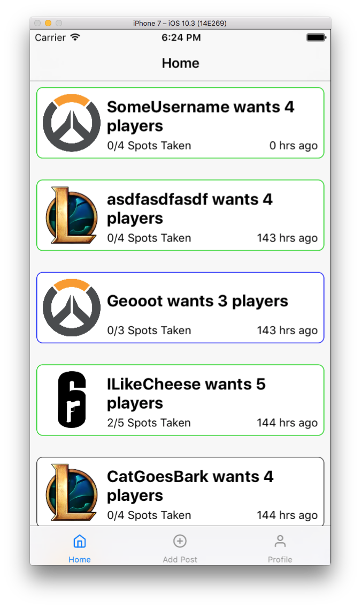

# project-lfg
[[Source]](https://github.com/geooot/project-lfg)  [[Website]](https://geooot.com/project-lfg)

This was a school project in which we created an original app of our own idea in what is essentially 23 hours of work (spread out across like 4 weeks).

Our idea was to create an app that made finding people to play games with easier. While there are many ways to find people to play with, most people put their faith into the game’s own matchmaking system to find games, but the goal of our app is to aid in the process of creating groups, and not having to join random players.
Hence the name “Project LFG,” where “LFG” is a common acronym used by video game fans that stands for “Looking for Group”.

The app is centered around 2 features, looking at posted groups, and creating a group yourself. As the app revolves around finding people, being able to join with people who need people, and being able to initiate the search yourself are what the app focuses on. 

Were we successfull? Not really...

## Things that could make this better
- Saving user data for each game.
- Creating a filter system by:
  - Game Rank
  - Hours in Game
- Creating a messaging system within the parties.
- Dark Mode

## Technologies
- Firebase (Firestore and Authentication)
- Eureka (albeit a beta version since we were stuck on xcode 8)

## Trying it out
There is pretty much a 0% chance this will work when you try it (it sure doesn't work on xcode 9). If you have xcode 8, maybe you will have some luck (if i decide to keep the firebase project still up). But don't bet on this working. However, You can see a small video demonstration [here if you want](https://geooot.com/project-lfg/lfg.mp4).

## Devs
- George Thayamkery
- Tosh Witherspoon
- Jackson Baxter
- Sam Su
